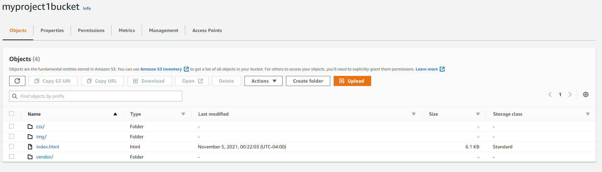
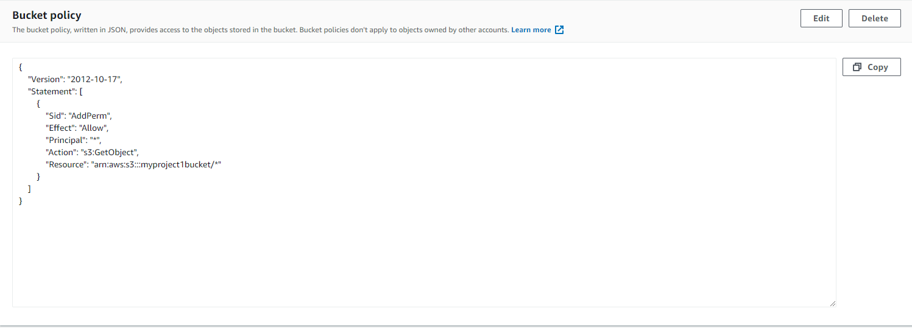

# Deploy Static Website on AWS

In this project, a static website is deployed to AWS using S3, CloudFront, and IAM.

The key files included are the following:

index.html - The Index document for the website.
/img - The background image file for the website.
/vendor - Bootstrap CSS framework, Font, and JavaScript libraries needed for the website to function.
/css - CSS files for the website.

## URL for static website

http://myproject1bucket.s3-website-us-east-1.amazonaws.com/
d2dk9t9iur11jv.cloudfront.net

## Steps used for deployment

### Step 1 - Create S3 Bucket

1. Navigate to the “AWS Management Console” page, type “S3” in the “Find Services” box and then select “S3”.
2. The Amazon S3 dashboard displays. Click “Create bucket”.
3. In the General configuration, enter a “Bucket name” and a region of your choice. Note: Bucket names must be globally unique.
4. In the Bucket settings for Block Public Access section, uncheck the “Block all public access”. It will enable the public access to the bucket objects via the S3 object URL.
5. Click “Next” and click “Create bucket”.
6. Once the bucket is created, click on the name of the bucket to open the bucket to the contents.

### Step 2 - Upload files to S3 Bucket

1. Once the bucket is open to its contents, click the “Upload” button.
2. Click the "Add files" and “Add folder” button, and upload the Student-ready starter code folder content from your local computer to the S3 bucket.
3. Click "Add files" to upload the index.html file, and click "Add folder" to upload the css, img, and vendor folders.
4. Do not select the udacity-starter-website folder. Instead, upload its content one-by-one.

#### Screenshot of files uploaded to S3 Bucket



### Step 3 - Secure Bucket via IAM

1. Click on the “Permissions” tab.
2. The “Bucket Policy” section shows it is empty. Click on the Edit button.
3. Enter the following bucket policy replacing your-website with the name of your bucket and click “Save”.
   Use the following:

```json
{
  "Version": "2012-10-17",
  "Statement": [
    {
      "Sid": "AddPerm",
      "Effect": "Allow",
      "Principal": "*",
      "Action": ["s3:GetObject"],
      "Resource": ["arn:aws:s3:::your-website/*"]
    }
  ]
}
```

#### Screenshot of S3 bucket in the AWS Management console with access being "Public"


#### Screenshot of S3 bucket with modified IAM policy



### Step 4 - Configure S3 Bucket

1. Go to the Properties tab and then scroll down to edit the Static website hosting section.
2. Click on the “Edit” button to see the Edit static website hosting screen. Now, enable the Static website hosting, and provide the default home page and error page for your website.
3. For both “Index document” and “Error document”, enter “index.html” and click “Save”. After successfully saving the settings, check the Static website hosting section again under the Properties tab.

### Step 5 - Distribute Website via Cloudfront

1. Select “Services” from the top left corner and enter “cloud front” in the “Find a service by name or feature” text box and select “CloudFront”.
2. From the CloudFront dashboard, click “Create Distribution”.
3. For “Select a delivery method for your content”, click “Get Started”.
4. Use the following details to create a distribution:
   Origin Domain Name: Don't select the bucket from the dropdown list. Paste the Static website hosting endpoint of the form <bucket-name>.s3-website-region.amazonaws.com
   Bucket Access: Yes, use a new Origin Access Identity (OAI) for the CloudFront. Allow OAI to update the bucket policy.
   Origin Shield: No.
   Default cache behavior: Use default settings.
   Cache key and origin requests: Use default settings.
5. Leave the defaults for the rest of the options, and click “Create Distribution”. It may take up to 10 minutes for the CloudFront Distribution to get created.
6. Once the status of your distribution changes from “In Progress” to “Deployed”, copy the endpoint URL for your CloudFront distribution found in the “Domain Name” column.

#### Screenshot of CloudFront Distribution "Enabled"


### Step 6 - Access Website in Web Browser

1. Open a web browser like Google Chrome, and paste the copied CloudFront domain name (such as, dgf7z6g067r6d.cloudfront.net) without appending /index.html at the end. The CloudFront domain name should show you the content of the default home-page.
2. Access the website via website-endpoint, such as http://<bucket-name>.s3-website.us-east-2.amazonaws.com/.
3. Access the bucket object via its S3 object URL, such as, https://<bucket-name>.s3.amazonaws.com/index.html.
